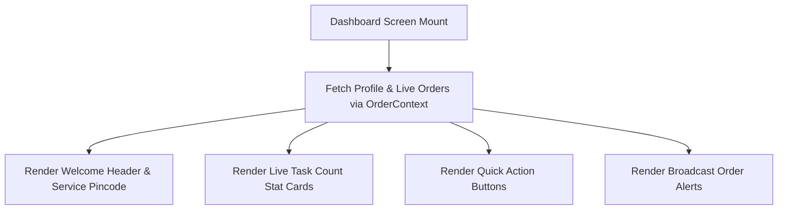

# SHG MOBILE APP (REACT NATIVE / EXPO)
## Complete Project Documentation & Technical Onboarding Manual
**Easy-to-understand guide for interns, developers, testers and new team members**  
**Version:** 1.0.0  
**Company:** Gramuunati Logistics (GMU)  
**Target Audience:** Interns, Mobile Engineers, Full-Stack Developers, & QA Testers  
**Last Updated:** August 2026  

---

## How to use this guide

Welcome to the **SHG Mobile App Engineering Team**! If you are completely new, read **Sections 1–6** first. Then follow **Section 8** to install the project and **Section 11** to run it. Use the remaining sections as a reference while working.

> [!IMPORTANT]
> **Security Notice:** Mobile app environment files (`.env`), API URLs, and JWT access tokens stored in `AsyncStorage` must be handled securely. Never commit secret credentials or production API keys to Git repositories.

---

# 1. Project Introduction

**SHG Mobile App** (`apps/shg-app`) is the native mobile field application for Self Help Group (SHG) members and Community Resource Persons (CRPs) in the Gramuunati Logistics network. Built with **React Native (v0.81)** and **Expo SDK (v54)**, it connects village producers (Sellers), local field agents, transporters, and end buyers into a seamless first-mile and last-mile mobile workflow.

The most important thing for a new team member to understand is that **the SHG App operates directly in village field conditions**. An SHG member uses this app to pick up goods from remote village sellers, generate parcel QR codes, verify 4-digit handover codes, hand off cargo to drivers, and deliver orders to buyers' doorsteps.

### Example Field Workflow
```text
Order Broadcast Notification -> SHG Accepts Task -> Seller Visit & Item Inspection -> QR Code Generation -> Seller Handover OTP -> Transporter Handover -> Buyer Doorstep Delivery OTP -> Earning Credited
```

---

# 2. What is SHG App?

**SHG App** is a cross-platform mobile application powered by **React Native**, **Expo SDK**, **NativeWind (Tailwind CSS)**, **React Navigation v7**, and **i18next** (supporting English, Hindi, and regional languages). In simple words, it is software that helps village SHG members manage localized logistics tasks on their Android/iOS smartphones.

```text
Seller Address & Item Request
↓
Pickup Order Acceptance
↓
Physical Item Verification & QR Generation (Parcel)
↓
Dual OTP Handover to Transporter
↓
Last-Mile Doorstep Delivery to Buyer
↓
Delivery OTP Verification
↓
Financial Commission Credit (Earning)
```

> [!TIP]
> **Core Developer Rule:** When working on any mobile screen or feature, always ask: **"How will this screen perform under low-network rural connectivity when a user is scanning a parcel in the field?"**

---

# 3. What SHG App Does

The SHG App is structured into 5 core operational modules:

| Module | Purpose & Capabilities | Primary Screens |
| :--- | :--- | :--- |
| **1. Dashboard (Home)** | Central operational hub rendering live task counters, broadcast alerts, quick action shortcuts, recent activity logs, and system status. | `DashboardScreen.tsx` |
| **2. Order Management** | Manages the full lifecycle of first-mile pickups, transporter handovers, doorstep drop deliveries, returned parcels, and redirected orders. | `OrderManagementScreen.tsx`, `IncomingOrdersScreen.tsx`, `AcceptedOrdersScreen.tsx`, `DropScreen.tsx`, `PickupScannerScreen.tsx`, `OrderDetailsScreen.tsx`, `VehicleSuggestionDetailsScreen.tsx`, `ReturnedOrdersScreen.tsx`, `RedirectedOrdersScreen.tsx` |
| **3. Order History** | Provides an audit log of past deliveries, search filtering, status filters, and step-by-step parcel tracking history. | `OrderHistoryScreen.tsx`, `OrderHistoryDetailsScreen.tsx`, `CompletedOrdersScreen.tsx`, `CompletedOrderDetailsScreen.tsx` |
| **4. Earnings** | Financial ledger rendering total earned commissions, daily/weekly payout breakdowns, completed order earnings, and withdrawal history. | `EarningsScreen.tsx` |
| **5. Stock / Inventory** | Local village product management screen allowing SHGs to register products, update stock quantities, view daily production, and set prices. | `StockManagementScreen.tsx` |

---

# 4. Complete Business Flow

Learn these flows before reading the code.

### 4.1 First-Mile Seller Pickup Flow
```text
Order Broadcast Appears on Dashboard
↓
SHG Member Accepts Pickup Task (IncomingOrdersScreen)
↓
Visits Seller Location & Inspects Goods (AcceptedOrdersScreen)
↓
Scans / Generates Parcel QR Code via Expo Camera (PickupScannerScreen)
↓
Seller Provides Handover OTP Code
↓
Pickup Confirmed -> Status: PARCEL_PICKED
```

### 4.2 Transporter Handover Flow
```text
Transporter Arrives at Village Pickup Node
↓
Transporter Scans Parcel QR Code
↓
SHG App Displays 4-Digit Handover Code
↓
SHG Shares Code Verbally with Transporter
↓
Transporter Enters Code -> Status: IN_TRANSIT_TO_HUB
```

### 4.3 Last-Mile Doorstep Delivery Flow
```text
Parcel Delivered to Village SHG by Drop Transporter (PARCEL_AT_DROP_SHG)
↓
SHG Member Receives Notification (DropScreen)
↓
Visits Buyer Address & Inspects Items
↓
Buyer Inspects Goods & Provides Delivery OTP
↓
SHG Enters Delivery OTP -> Status: DELIVERED
↓
Commission Instantly Credited to SHG Wallet (EarningsScreen)
```

### 4.4 Reverse Logistics (Return Flow)
```text
Buyer Requests Return / Delivery Fails (RETURN_REQUESTED)
↓
SHG Receives Return Task (ReturnedOrdersScreen)
↓
Collects Parcel from Buyer & Verifies Condition
↓
Hands Off Return Parcel to Transporter -> Status: RETURN_IN_TRANSIT
```

### Why the flow matters
If an SHG member confirms a seller pickup without completing the OTP verification, the parcel custody will not transfer correctly in the backend database. Therefore, **always test the complete physical flow end-to-end.**

---

# 5. Users and Roles

| Role | Easy Explanation | Responsibilities in App |
| :--- | :--- | :--- |
| **SHG Member / CRP** | Primary mobile app user (Village Field Agent). | Accepting order broadcasts, collecting goods from sellers, generating QR codes, handing off cargo to drivers, delivering to buyers. |
| **Individual SHG / CRP** | Independent local service provider. | Managing localized pickup and doorstep delivery tasks within assigned service pincodes. |
| **Seller** | Rural producer / artisan. | Preparing packages, providing seller handover OTP to SHG member. |
| **Transporter Driver** | Commercial vehicle driver. | Receiving cargo from SHG, providing driver handover PIN. |
| **Buyer** | End consumer. | Receiving doorstep package delivery, providing buyer delivery OTP. |
| **GMU Admin** | Hub administrator. | Reviewing SHG profile registrations and approving village service area coverage. |

*For an access problem, check authentication (logged in via phone OTP?) and role permissions.*

---

# 6. Technology Used

| Technology | Simple Meaning | Use in Project |
| :--- | :--- | :--- |
| **React Native (v0.81)** | Mobile App Framework | Renders native iOS and Android user interface components. |
| **Expo SDK (v54)** | Mobile Tooling Suite | Provides native device access: `expo-camera` (QR scanner), `expo-location` (GPS), `expo-haptics`. |
| **React Navigation (v7)** | Mobile Navigation Library | Bottom tab navigator (`MainTabNavigator`) and native stack navigators (`OrdersStack`). |
| **NativeWind (v4)** | Tailwind for React Native | Utility-first CSS styling for native mobile components (`className="..."`). |
| **i18next & react-i18next** | Internationalization Framework | Multilingual support for English, Hindi, Marathi, and regional languages. |
| **OrderContext** | React Context API | Manages live mobile orders state, broadcast polling, and action methods. |
| **Axios** | HTTP Request Library | Configured in `axiosInstance.ts` to attach Bearer JWT tokens to backend API requests. |
| **AsyncStorage** | Mobile Storage Engine | Persists user tokens (`userToken`), language preferences, and onboarding state. |

### Overall Mobile Architecture
```text
Mobile Phone (React Native / Expo)
↓
UI Screens (Dashboard, Orders, Scanner, Earnings)
↓
OrderContext & Custom Hooks
↓
Axios Client (axiosInstance.ts) + Bearer JWT Header
↓ HTTP REST Request
NestJS Backend Server (http://<LOCAL-IP>:3000/api)
↓
Prisma ORM & PostgreSQL Database
```

---

# 7. Project Structure

The SHG App codebase is located under [apps/shg-app/](file:///c:/Users/parth/OneDrive/Desktop/GST-v1/logistic/apps/shg-app):

```text
apps/shg-app/
■■■ src/
■ ■■■ api/              → Axios HTTP instance & request interceptors (axiosInstance.ts)
■ ■■■ components/       → Reusable mobile UI components (OrderCard, AddressDetailsModal, FilterModal, RescheduleModals)
■ ■■■ constants/        → Colors, typography, and API routes
■ ■■■ context/          → Centralized state stores (OrderContext, UserContext, LanguageContext, OnboardingContext)
■ ■■■ locales/          → i18n translation JSON files (English, Hindi, Marathi)
■ ■■■ navigation/       → App navigators (AppNavigator.tsx, MainTabNavigator.tsx, types.ts)
■ ■■■ screens/          → All 28 application screen views
■ ■ ■■■ DashboardScreen.tsx            → Module 1: Home Dashboard Screen
■ ■ ■■■ OrderManagementScreen.tsx      → Module 2: Main Orders Hub
■ ■ ■■■ IncomingOrdersScreen.tsx       → Module 2: New Broadcast Orders Feed
■ ■ ■■■ AcceptedOrdersScreen.tsx       → Module 2: Active Pickup Orders & Handovers
■ ■ ■■■ PickupScannerScreen.tsx        → Module 2: Expo Camera QR Barcode Scanner
■ ■ ■■■ DropScreen.tsx                 → Module 2: Doorstep Buyer Delivery Screen
■ ■ ■■■ ReturnedOrdersScreen.tsx       → Module 2: Reverse Logistics Return Tasks
■ ■ ■■■ RedirectedOrdersScreen.tsx     → Module 2: Re-routed Leg Tasks
■ ■ ■■■ OrderDetailsScreen.tsx         → Module 2: Itemized Order & Parcel Summary
■ ■ ■■■ VehicleSuggestionDetailsScreen.tsx → Module 2: Weight & Recommended Vehicle View
■ ■ ■■■ OrderHistoryScreen.tsx         → Module 3: Past Delivery Audit & Timeline Search
■ ■ ■■■ CompletedOrdersScreen.tsx      → Module 3: Completed Orders Roster
■ ■ ■■■ EarningsScreen.tsx             → Module 4: Wallet Balance & Commission Ledger
■ ■ ■■■ StockManagementScreen.tsx      → Module 5: Village Product & Stock Management
■ ■ ■■■ LoginScreen.tsx                → Auth: Phone OTP Login
■ ■ ■■■ SignupScreen.tsx               → Auth: Multi-step Registration Workflow
■ ■ ■■■ ProfileScreen.tsx              → User: SHG Profile & Service Area Settings
■ ■■■ services/          → API integration services (authService, inventoryService, signupService)
■ ■■■ utils/             → Helper utilities & date formatters
■■■ App.tsx              → Root application component & provider wrapper
■■■ app.json             → Expo project configuration
■■■ package.json         → Mobile dependencies & npm workspace scripts
■■■ tailwind.config.js   → NativeWind Tailwind configuration
```

---

# 8. Requirements and Installation

### System Requirements

| Tool | Requirement |
| :--- | :--- |
| **Node.js** | v20.x LTS recommended (`node -v`) |
| **npm** | v10.x or higher (`npm -v`) |
| **Expo CLI** | Run via `npx expo` |
| **Mobile Hardware / Emulator** | Physical Android/iOS phone with Expo Go app OR Android Studio Emulator |
| **Network** | Development laptop and mobile phone MUST be connected to the SAME Wi-Fi network. |

### Step 1 — Install Dependencies
Run from monorepo root:
```bash
npm install
```

### Step 2 — Verify Expo Installation
```bash
npx expo --version
```

---

# 9. Environment Configuration

The SHG App uses environment variables defined in `apps/shg-app/.env`:

| Variable | Purpose | Example Value |
| :--- | :--- | :--- |
| `EXPO_PUBLIC_API_BASE_URL` | Local API server IP address & port | `http://192.168.1.15:3000/api` |
| `EXPO_PUBLIC_APP_ENV` | Runtime environment mode | `development` |

> [!WARNING]
> **Mobile IP Address Rule:** When testing on a physical mobile phone, `localhost` refers to the mobile phone itself! ALWAYS replace `localhost` in `EXPO_PUBLIC_API_BASE_URL` with your laptop's local network IP address (e.g. `http://192.168.1.15:3000/api`).

---

# 10. Database and Prisma Integration

The SHG App interacts with the NestJS backend, which maps requests to PostgreSQL database models via Prisma ORM ([schema.prisma](file:///c:/Users/parth/OneDrive/Desktop/GST-v1/logistic/backend/app/prisma/schema.prisma)):

| Database Model | SHG App Role & Data Usage |
| :--- | :--- |
| `User` | Stores SHG member profile, phone number, language preference, and application approval status (`ApplicationStatus`). |
| `ShgDetail` | Stores group name, leader name, member code, group size, and CRP contact details. |
| `ShgServiceArea` | Maps the SHG member to specific village names and pincodes for order broadcasts. |
| `PickupOrder` | First-mile pickup tasks assigned to the SHG member. |
| `DropOrder` | Last-mile doorstep delivery tasks assigned to the SHG member. |
| `Parcel` | Individual box items containing QR codes (`qrCodeValue`), weight, and current holder. |
| `VerificationRecord` | Stores generated 4-digit handover codes and buyer delivery OTPs. |
| `Earning` | Financial credit ledger logging commission amounts for completed delivery legs. |

---

# 11. How to Run the Project

Normal mobile development startup:

### 1. Start NestJS Backend (Terminal 1)
```bash
cd backend/app
npm run start:dev
```

### 2. Start SHG App Metro Bundler (Terminal 2)
From monorepo root:
```bash
npm run shg-app:start
```

### 3. Open App on Mobile Device
* Scan the QR code displayed in the terminal using the **Expo Go** app on your Android phone or Camera app on iOS.
* Alternatively, press `a` in terminal to launch Android Studio Emulator.

---

# 12. Authentication and Security

```text
Phone Number Input -> Send OTP -> Enter 4-Digit OTP (1234 in DEV mode) -> Backend Issues JWT Token -> Saved to AsyncStorage -> MainTabNavigator Displayed
```

### Key Security Implementations
* **AsyncStorage Token Persistence:** The JWT access token is stored securely under key `userToken`.
* **Axios Request Interceptor:** Located in `axiosInstance.ts`, automatically attaches header `Authorization: Bearer <token>` to every outgoing request.
* **Developer OTP Bypass:** Setting `DEV_OTP_BYPASS=true` in `backend/app/.env` allows testing any phone number using test OTP `1234`.

---

# 13. Master & Reference Data

Master data is loaded from the backend to populate mobile screens:

* **Pincode & Village Directory:** Populates service area dropdowns during signup (`pincode` table).
* **Product Catalog:** Lists rural commodities (agriculture, textiles, handicrafts, dairy) in Stock Management.
* **Seller Contact Cards:** Provides village seller address, phone number, and location navigation.
* **Buyer Contact Cards:** Provides buyer delivery address, house number, and contact info.

---

# 14. Module 1 — Dashboard (Home)

### 14.1 Screen Overview
The **Dashboard Screen** ([DashboardScreen.tsx](file:///c:/Users/parth/OneDrive/Desktop/GST-v1/logistic/apps/shg-app/src/screens/DashboardScreen.tsx)) is the primary landing screen after login.



### 14.2 Dashboard Elements & Actions
* **Welcome Header:** Displays SHG Leader Name, Group Name, and assigned service pincode.
* **Stat Cards:** Live counters for **Incoming Broadcasts**, **Active Pickups**, **Active Drops**, and **Total Earnings**.
* **Quick Action Buttons:** Direct navigation to Scanner (`PickupScannerScreen`), Earnings (`EarningsScreen`), and Stock Management (`StockManagementScreen`).
* **Broadcast Alert Banner:** Notifies the SHG member immediately when a new seller pickup is available in their village.

---

# 15. Module 2 — Order Management

The **Order Management Module** manages the complete multi-leg lifecycle through dedicated sub-screens:

### 15.1 Sub-Screens Breakdown

#### 1. Incoming Orders Screen ([IncomingOrdersScreen.tsx](file:///c:/Users/parth/OneDrive/Desktop/GST-v1/logistic/apps/shg-app/src/screens/IncomingOrdersScreen.tsx))
* Displays unassigned pickup orders broadcasted to the SHG's service area.
* Shows seller name, village address, distance indicator (`OrderDistance.tsx`), total weight, and product count.
* **Actions:** `Accept Order` (assigns task to SHG) or `Decline Order`.

#### 2. Accepted Orders Screen ([AcceptedOrdersScreen.tsx](file:///c:/Users/parth/OneDrive/Desktop/GST-v1/logistic/apps/shg-app/src/screens/AcceptedOrdersScreen.tsx))
* Lists active pickup tasks currently accepted by the SHG member.
* Displays seller contact info, pickup schedule, and navigation address.
* **Actions:** `Start Pickup` (opens camera scanner), `Call Seller`, `Reschedule Pickup`.

#### 3. Camera QR Barcode Scanner ([PickupScannerScreen.tsx](file:///c:/Users/parth/OneDrive/Desktop/GST-v1/logistic/apps/shg-app/src/screens/PickupScannerScreen.tsx))
* Integrated with `expo-camera` to scan physical package barcodes during seller visits.
* Generates `Parcel` QR images and verifies physical box count.
* Prompts entry of the 4-digit **Seller Handover OTP** to confirm physical pickup.

#### 4. Drop Screen ([DropScreen.tsx](file:///c:/Users/parth/OneDrive/Desktop/GST-v1/logistic/apps/shg-app/src/screens/DropScreen.tsx))
* Manages last-mile doorstep delivery tasks to buyers.
* Displays buyer address, house number, phone number, and package items.
* **Actions:** `Verify Buyer OTP` (enters 4-digit code provided by buyer to complete delivery and credit earnings).

#### 5. Returned & Redirected Orders Screens ([ReturnedOrdersScreen.tsx](file:///c:/Users/parth/OneDrive/Desktop/GST-v1/logistic/apps/shg-app/src/screens/ReturnedOrdersScreen.tsx), [RedirectedOrdersScreen.tsx](file:///c:/Users/parth/OneDrive/Desktop/GST-v1/logistic/apps/shg-app/src/screens/RedirectedOrdersScreen.tsx))
* Handles reverse logistics return tasks and orders redirected due to partner unavailability.

#### 6. Order Details & Vehicle Suggestion Screens ([OrderDetailsScreen.tsx](file:///c:/Users/parth/OneDrive/Desktop/GST-v1/logistic/apps/shg-app/src/screens/OrderDetailsScreen.tsx), [VehicleSuggestionDetailsScreen.tsx](file:///c:/Users/parth/OneDrive/Desktop/GST-v1/logistic/apps/shg-app/src/screens/VehicleSuggestionDetailsScreen.tsx))
* Comprehensive itemized breakdown of products, weights, declared values, and recommended transporter vehicle based on parcel payload weight.

---

# 16. Module 3 — Order History

### 16.1 Purpose
The **Order History Module** ([OrderHistoryScreen.tsx](file:///c:/Users/parth/OneDrive/Desktop/GST-v1/logistic/apps/shg-app/src/screens/CompletedOrdersScreen.tsx), `CompletedOrdersScreen.tsx`) provides an audit trail of all completed and past deliveries.

### 16.2 Features & Audit Tools
* **Search Filter:** Search by Order ID, Seller Name, Buyer Name, or Village.
* **Status Filter Tabs:** Filter by `Completed`, `Returned`, or `Cancelled`.
* **Step Timeline:** Opens `TrackingHistoryModal.tsx` to display step-by-step physical scan history with timestamps and handler roles.

---

# 17. Module 4 — Earnings

### 17.1 Purpose
The **Earnings Screen** ([EarningsScreen.tsx](file:///c:/Users/parth/OneDrive/Desktop/GST-v1/logistic/apps/shg-app/src/screens/EarningsScreen.tsx)) acts as the SHG member's financial wallet and commission ledger.

### 17.2 Wallet Features & Ledger
* **Total Balance:** Displays total accumulated earnings balance.
* **Recent Payouts:** Itemized ledger showing commission earned per completed delivery leg.
* **Filter Tabs:** View daily, weekly, and monthly commission performance.
* **Payout Status:** Indicates payment status (`CREDITED`, `PENDING_SETTLEMENT`).

---

# 18. Module 5 — Stock / Inventory Management

### 18.1 Purpose
The **Stock Management Screen** ([StockManagementScreen.tsx](file:///c:/Users/parth/OneDrive/Desktop/GST-v1/logistic/apps/shg-app/src/screens/StockManagementScreen.tsx)) enables SHGs to manage local village product inventory.

### 18.2 Features
* **Product Registration:** Add new products produced by the SHG (handicrafts, agriculture, food items).
* **Stock Quantity Updates:** Update available stock units (`stock`) and unit prices (`price`).
* **Production Logs:** Record daily and weekly production output (`dailyProduction`, `weeklyProduction`).

---

# 19. API and Mobile/Backend Communication

```text
User Action on Screen -> Trigger Method in OrderContext -> Call axiosInstance -> HTTP Request to NestJS -> Guard & DTO Check -> Service & Prisma -> PostgreSQL -> JSON Response back to Mobile Screen
```

| Area | HTTP Method & Path | Mobile Service Method |
| :--- | :--- | :--- |
| **Auth** | `POST /api/auth/send-otp` | `authService.sendOtp()` |
| **Auth** | `POST /api/auth/verify-otp` | `authService.verifyOtp()` |
| **Pickup Broadcasts** | `GET /api/shg/orders/broadcasts` | `OrderContext.fetchBroadcasts()` |
| **Accept Pickup** | `POST /api/shg/orders/:id/accept` | `OrderContext.acceptOrder()` |
| **Verify Pickup OTP** | `POST /api/shg/orders/verify-handover` | `OrderContext.verifyPickupHandover()` |
| **Buyer Delivery** | `POST /api/shg/orders/complete-delivery` | `OrderContext.completeDelivery()` |
| **Earnings** | `GET /api/shg/earnings` | `OrderContext.fetchEarnings()` |
| **Inventory** | `GET /api/shg/inventory` | `inventoryService.getInventory()` |

---

# 20. How to Debug a Problem

Follow this 10-step mobile debugging workflow when an issue occurs:

```text
1. Understand mobile screen requirement
↓
2. Reproduce issue on mobile emulator / device
↓
3. Inspect Metro Bundler terminal output for JavaScript errors
↓
4. Check Network request URL (verify IP is NOT localhost)
↓
5. Check NestJS backend terminal logs for 400/500 errors
↓
6. Verify JWT token in AsyncStorage (`userToken`)
↓
7. Inspect Expo Camera permissions if QR scanning fails
↓
8. Check Prisma query in backend
↓
9. Fix root cause in screen or service
↓
10. Test complete physical flow again
```

---

# 21. Common Errors & Fixes

| Problem | Likely Reason | First Check |
| :--- | :--- | :--- |
| **Network Request Failed** | `EXPO_PUBLIC_API_BASE_URL` uses `localhost` instead of laptop IP. | Change `localhost` to laptop Wi-Fi IP address in `shg-app/.env`. |
| **Camera Scanner Black Screen** | Camera permissions not granted on phone. | Grant camera permission in phone settings or prompt `useCameraPermissions()`. |
| **Metro Bundler Stale Cache** | Metro bundler holding old JavaScript build code. | Restart Metro bundler: `npm run shg-app:start -- --clear`. |
| **401 Session Expired** | JWT token expired or cleared from `AsyncStorage`. | Log out and re-authenticate via phone OTP login screen. |
| **NativeWind Styles Not Applying** | Missing `global.css` import or stale Babel cache. | Verify `global.css` import in `App.tsx` and restart bundler. |

---

# 22. Git and Development Workflow

Use a feature branch for every mobile task.

```bash
git pull origin main
git status
git checkout -b feature/shg-otp-screen

# Make changes & test on mobile emulator
git add .
git commit -m "feat(shg-app): update seller OTP verification modal layout"
git push -u origin feature/shg-otp-screen
```

### Before Pushing Checklist
* Test screen layout on different phone screen sizes.
* Test pickup and delivery flows end-to-end.
* Check Metro bundler terminal for warnings.
* Verify no hardcoded API URLs or secrets.

---

# 23. Testing Checklist

| Check | Question |
| :--- | :--- |
| **UI** | Does the mobile screen render cleanly on both small and large phone screens? |
| **Validation** | Are empty form inputs rejected with helpful toast messages? |
| **API** | Does Axios send requests to the correct IP endpoint with Bearer token? |
| **Camera** | Does the QR barcode scanner detect parcel codes instantly? |
| **OTP** | Does handover fail gracefully when an invalid OTP is entered? |
| **Earnings** | Does wallet balance update immediately after a delivery is completed? |
| **Offline/Network** | Does the app display a clean error message if Wi-Fi drops? |

---

# 24. Production Overview

### Expo Application Services (EAS) Build
For production deployment, mobile app binaries are compiled using EAS:

```bash
# Build Android APK / AAB
eas build --platform android

# Build iOS IPA
eas build --platform ios
```

---

# 25. Important Commands Cheat Sheet

| Task | Command |
| :--- | :--- |
| **Start Metro Bundler** | `npm run shg-app:start` |
| **Start Tunnel Mode** | `npm run shg-app:start-tunnel` |
| **Clear Metro Cache** | `npm run shg-app:start -- --clear` |
| **Run Android Emulator** | Press `a` in Metro terminal |
| **Run iOS Simulator** | Press `i` in Metro terminal |

---

# 26. Intern Learning Plan

| Stage | Learn Roadmap |
| :--- | :--- |
| **Day 1** | Understand SHG field role, install Expo Go on phone, run `shg-app`. |
| **Days 2–3** | Explore `src/navigation` and main bottom tab screens (`Dashboard`, `Orders`, `History`, `Earnings`, `Stock`). |
| **Days 4–5** | Trace `OrderContext.tsx` and API calls in `axiosInstance.ts`. |
| **Week 2** | Test first-mile seller pickup flow and camera QR barcode scanner (`PickupScannerScreen.tsx`). |
| **Week 3** | Test doorstep delivery flow (`DropScreen.tsx`) and earnings wallet updating (`EarningsScreen.tsx`). |
| **Week 4** | Pick a real mobile backlog task; write code, test on device, and submit Pull Request. |

---

# 27. Final Checklist

| I can... | Done |
| :--- | :---: |
| Explain what SHG App is and who uses it in the village field. | [ ] |
| Run `shg-app` locally using Expo Metro bundler. | [ ] |
| Configure `EXPO_PUBLIC_API_BASE_URL` with my laptop's Wi-Fi IP address. | [ ] |
| Find mobile screens in `src/screens` and components in `src/components`. | [ ] |
| Trace how `OrderContext` fetches live orders from backend APIs. | [ ] |
| Test seller pickup and camera QR barcode scanning on a phone. | [ ] |
| Test buyer doorstep delivery and OTP verification. | [ ] |
| Verify earnings wallet updates after delivery completion. | [ ] |
| Debug mobile issues using Metro terminal and DevTools. | [ ] |
| Submit a clean Git branch and Pull Request. | [ ] |

---

# THE GOLDEN RULE

> [!IMPORTANT]
> **THE GOLDEN RULE:**  
> **Understand the business flow first $
ightarrow$ understand the code $
ightarrow$ make the smallest safe change $
ightarrow$ test the complete affected flow.**

*Prepared as an easy-to-understand complete project documentation for the Gramuunati Logistics (GMU) SHG Mobile App.*
